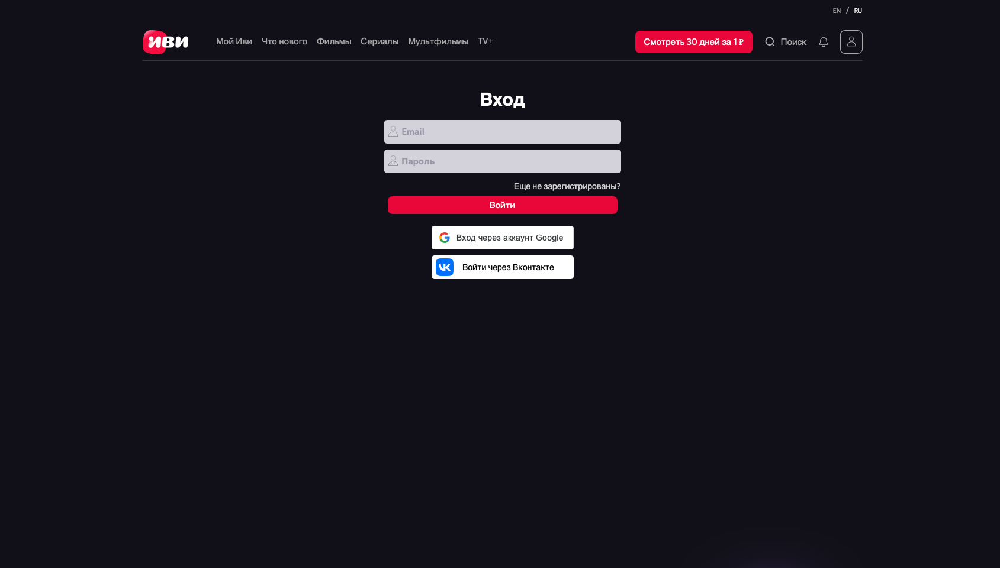
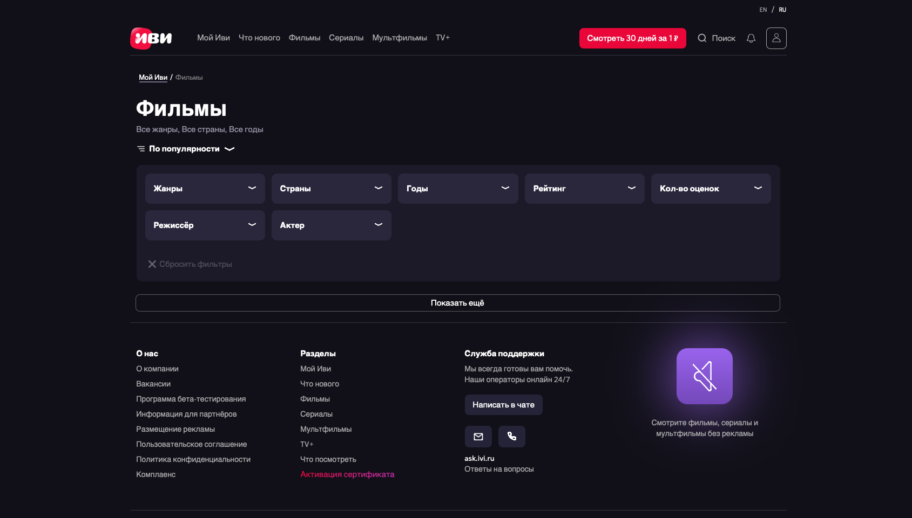

#  🎥 Movies-website
Упрощенная версия портала фильмов. В качестве дизайна за основу взят сайт ivi.ru

  
  
  

## 📃 Описание
Написано с помощью TypeScript, React (redux, axios, i18n, storybook), SCSS. Покрытие тестами - react testing library. 

## 📝 Функционал и внешний вид портала
- Главная страница
- Страница списка фильмов (/films/)
  - Функциональные фильтры
    - По странам/жанрам/годам
    - По рейтингу - возможность вводить конкретное значение ползунком с точностью до десятых 
    - По количеству оценок - возможность вводить конкретное значение ползунком
    - По режиссеру/ по актеру. Поле ввода ведет себя как автосаджест (подсказывает по первым буквам подходящих режиссеров)
    - Все фильтры разом доступны на странице /movies/ и сразу при выборе пользователя применяются без перезагрузки страницы
    - Выбор жанров влияет на хлебные крошки
  - Сортировка
    - По количеству оценок
    - По рейтингу 
    - По дате выхода (сначала свежие) 
    - По алфавиту 
  - Список карточек со всеми эффектами верстки (но по функционалу только переход к конкретному фильму)
- Страница конкретного фильма (/film/:id)
  - Трейлер
  - Описание фильма с реальными данными
  - Создание отзывов и комментариев к фильму
- Страница актера (/person/:id)
- Страница авторизации (/auth/)
  - Авторизация по почте/паролю, аккаунту google, аккаунту Vk 
- Страница администратора (/admin)
  - Доступ только у администратора (проверка на бэкенде, ссылка появляется в шапке при наличии роли)
  - Возможность редактировать названия фильма (для фильмов) и название жанра (для жанров) на русском и английском языке.
- Поиск
- Функционал перевода сайта на английский язык (переключатель в шапке)

## 🛠️ Инструкция по запуску проекта

### 🔐 Бэкенд

-	Клонируем репозиторий (master ветка) на ПК c https://github.com/Blazac97/ivi-clone-backend-app.git
-	Запускаем Docker (если он не установлен на ПК, то нужно скачать с офф сайта и установить).
-	Открываем в терминале папку с репозиторием.
-	Выполняем “npm i” для установки зависимостей.
-	Для запуска выполняем “ docker compose up -d“. 
-	Ожидаем запуск контейнеров, особенно необходимо подождать пока «поднимется» приложение внутри контейнера “kino-db-1”. Необходимо подождать примерно 1.5-2 минуты, пока внутри контейнера в консоль не будет выведено следующее (это нужно делать, поскольку этот сервис запускается дольше всех внутри контейнера).

-	Запуск тестов осуществляется командой “npm run test:watch”.
-	После того как все контейнеры будут развернуты, переходим к запуску фронт-части.

### 🖥️ Фронтенд

-	Клонируем репозиторий на ПК c https://github.com/mspolermo/movies-website.git
-	Открываем в терминале папку с репозиторием.
-	Выполняем “git checkout master”.
-	Выполняем “npm i”.
-	Для запуска сайта выполняем “npm start”. Сайт будет доступен по адресу: http://localhost:3000/movies-website/
-	Для запуска storybook выполняем “npm run storybook”. По умолчанию storybook будет доступен по адресу:  http://localhost:6006/
-	В случае, если storybook при первоначальной загрузке выдаст ошибку – страницу storybook в браузере следует обновить.
-	Для запуска тестов выполняем “npm run test”.

### 🪪 Дополнительная информация

-	Статичные комментарии добавлены в БД только к фильму "Форрест Гамп" (/movies-website/film/134). После авторизации на сайте можно создавать отзывы/комментарии к любому фильму.
-	Для завершения работы бэкенд-части необходимо в терминале, в папке с бэкенд-репозиторием выполнить “docker compose down”
-	Для остановки виртуальной машины на ПК (windows) необходимо выполнить команду в командной строке “wsl —shutdown” (чтобы убить процесс vmmem) 
-	Все вышеперечисленные команды для терминала следует выполнять без кавычек

#### 🪛 Добавление роли администратора к учетной записи пользователя
Поскольку юзерам при регистрации по умолчанию выдаётся роль “USER”, чтобы выдать пользователю роль “ADMIN” необходимо выполнить следующие действия:
  
  1.	Открыть сайт (http://localhost:3000/movies-website/) и перейти в раздел авторизации.

 

  2.	Нажать на кнопку «Еще не зарегистрированы?»

 

  3.	В поле «E-mail» ввести почту, в поле «Придумайте пароль» ввести пароль, состоящий минимум из 4 латинских букв. Нажать на кнопку «Зарегистрироваться».

 

  4.	Открыть страницу входа в pgAdmin. Актуальная ссылка для входа находится в Docker-е.

 

  5.	Авторизироваться с помощью логина: root@root.com и пароля: «root» (без кавычек). 

 

  6.	Подключить сервер, нажав на кнопку «Add New Server»

 

  7.	В открывшемся окне, во вкладке «General», ввести в поле «Name» имя сервера – любое, на ваше усмотрение. 

 

  8.	Во вкладке «Connection» в поле «Host name/address» ввести «db2» (без кавычек), в поле «Password» ввести «root» (без кавычек). Нажать кнопку «Save».

  9.	Сервер подключен. Необходимо проверить наличие зарегистрированного аккаунта (пункт 3) в БД. Данная информация находится в таблице «users».

  

  10.	Открыть таблицу «user_roles»:

 

  11.	Если регистрация пользователя была произведена корректно – в таблице существует запись, где «roleId» – id роли (примечание: 1 – “ADMIN”, 2 – “USER”), «userId» – id юзера. 

    Вариант 1.

Изменить существующую запись (изменив значение «roleId» - 2 на «roleId» - 1) и сохранить изменения в БД. Для этого нужно кликнуть два раза на значение, которое нужно изменить, внести корректировку и сохранить изменения в БД, используя кнопку «Save Data Changes»:

 

    Вариант 2.

С помощью кнопки «Add row» добавить запись (строку, где «roleId» – 1 , «userId» – 1) и сохранить изменения в БД, используя кнопку «Save Data Changes»:

 

12.	После выполнения вышеперечисленных действий нужно обновить страницу (http://localhost:3000/movies-website/) и залогиниться заново под учетной записью с ролью администратора. Если действия выполнены правильно – в шапке появится линк на страницу администратора.
